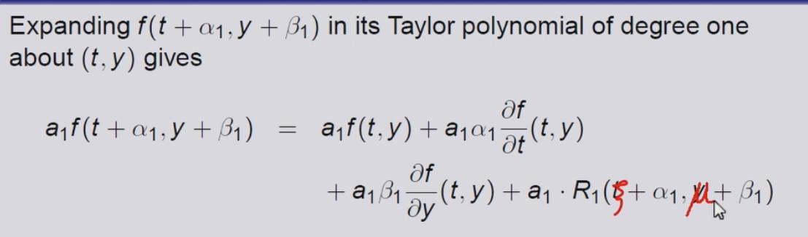
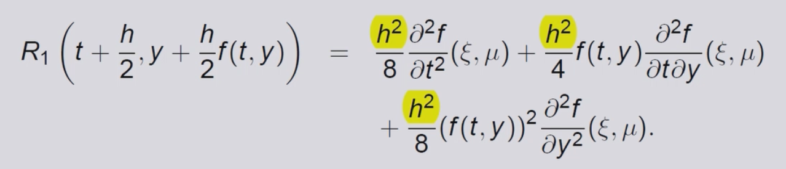

# Untitled

## initial-value problems

initial-value problems for CDES

### convex set的定义

D 是定义域的意思：

在定义域任何两点的链接 这两点连成的线都不会超过domain

### lipschitz condition

首先由L condition

对于每一个part 考虑 t 本身的最大值

### Existence of the unique solution

1. function\(t,y\) is convex & continuous on D
2. satisfies the L condition

then it has the unique solution

convex 的特殊情况：

#### elementary theory of the Initial-value problem\(IVPS\)

initial value is y\(a\)=a 最后的证明结果

**应用**

1. 首先证明是连续的 在定义域之上 同时convex
2. 满足了L condition

如何证明满足 L condition

* 首先求导
* 关注t的取值范围

同时也可以使用 Mean Value Theorem

#### Well-Posed Problems

Problem的变化会导致solution的变化吗

* unique solution是存在t的（符合了两个条件）
* 任意的 ε 选择
* initial value is y\(a\)=a+ε
* 同时满足 \|z\(t\)-y\(t\)\|&lt;k\*ε 呈现的是linear的关系

总之就是在一定范围之内 变化不大

conditions to ensure that an initial-value problem is well-posed

**应用**

始终注意 treat 't' as the constant when 求导的时候

small changes in the value will also get the small changes to the result \(Well posed\)

 注意x变成t

## Euler’s Method

### Derivation

目标是获得approximation to the well-posed IVP

* 连续的估计值无法获得
* 可以获得various value -- mesh points
* 使用interpolation可以只用算一个点

1. set up an equally-distrbuted mesh

我们首先规定 mesh points 均匀分布在定义域之上

1. using the taylor ==&gt; derivation of the Euler's method

* also depends on the index i

* also call the difference equation

1. apply the Euler's Method

### Numerical Algorithm\(算法\)

disp\("Euler's Method"\)  
%function defination  
clear  
clc

myF = @\(t,y\) y-t^2+1;

a=0;  
b=2;  
h=0.5;

alpha = 0.5;  
N=\(b-a\)/h;

fprintf\("t w\n\n"\)

%step1  
t=a  
w=alpha

fprintf\("%f %f\n\n",t,w\)

%step2  
for i = 1 : N  
 %Step3  
 w = w+h\*myF\(t,w\);  
 t=a+i\*h;  
 %step4  
 fprintf\("%f %f\n\n",t,w\)

 end %step5 STOP

### Geometric Interpretation

注意error会不断的积累 随着index的不断增大

### Numerical Example

## RL burden & J D Faires

### Computational Lemmas

### Error Bound for Euler's Method

### Error Bound Example

## Local Truncation Error

### Example

using the Euler's method

 每一步的error means in every step

### Extrapolation

* 如何从EM推理得到LTE
* Derivative（y\(ti\)）== f\(ti,yi\)
* 所以：Derivative——Derivative（y\(ti\)） == Derivative（ f\(ti,yi\) ）

### Higher Order Taylor Method

FOR THE ORDER N IN THE TM

* 目标 improving the convergence properties of the difference methods

n+1 连续性

拥有更高维度的TM

### Exapmle

#### n=2

error会不断的积累

TM都会不断的积累误差

we need to compute the 4 terms for the following terms

## Local Truncation Error\(Taylor\)

* 对于不同的order LTE 也是不同的减小的 error呈现指数级的减小

由于我们的 TM本身是有error的

分析变量和error的关系我们需要将其他的part 减去

Derivative（y\(ti\)）== f\(ti,yi\)

通过对最后一项的分析

记住将h除去

## Runge-Kutta Methods

### Intro& TM in 2 variable

#### compare with TM

* 评估的过程非常的复杂（TM）
* 需要求导

Runge-Kutta methods have the high-order local truncation error of the Taylor methods but eliminate the need to compute and evaluate the derivatives of f\(t, y\). Before presenting the ideas behind their derivation, we need to consider Taylor’s Theoremin two variables

#### 起源：2 Variable of the TM

**Pn就是第n项\(the nth iterm of\)的TM**

注意有reminder term存在

* the constant in the front is the C20 C21 C22

### two Variables of the RKM

#### 通过标准式子分离变量

COMPARE TO 系数对比

* 起源于f\(t,y\)
* 找到其中α和β是变量（沿着两个坐标轴）
* compare to the TM2 找到相应的系数

#### Result

### Midpoint Method

### Modified Euler Method

### Higer-order of RKM

